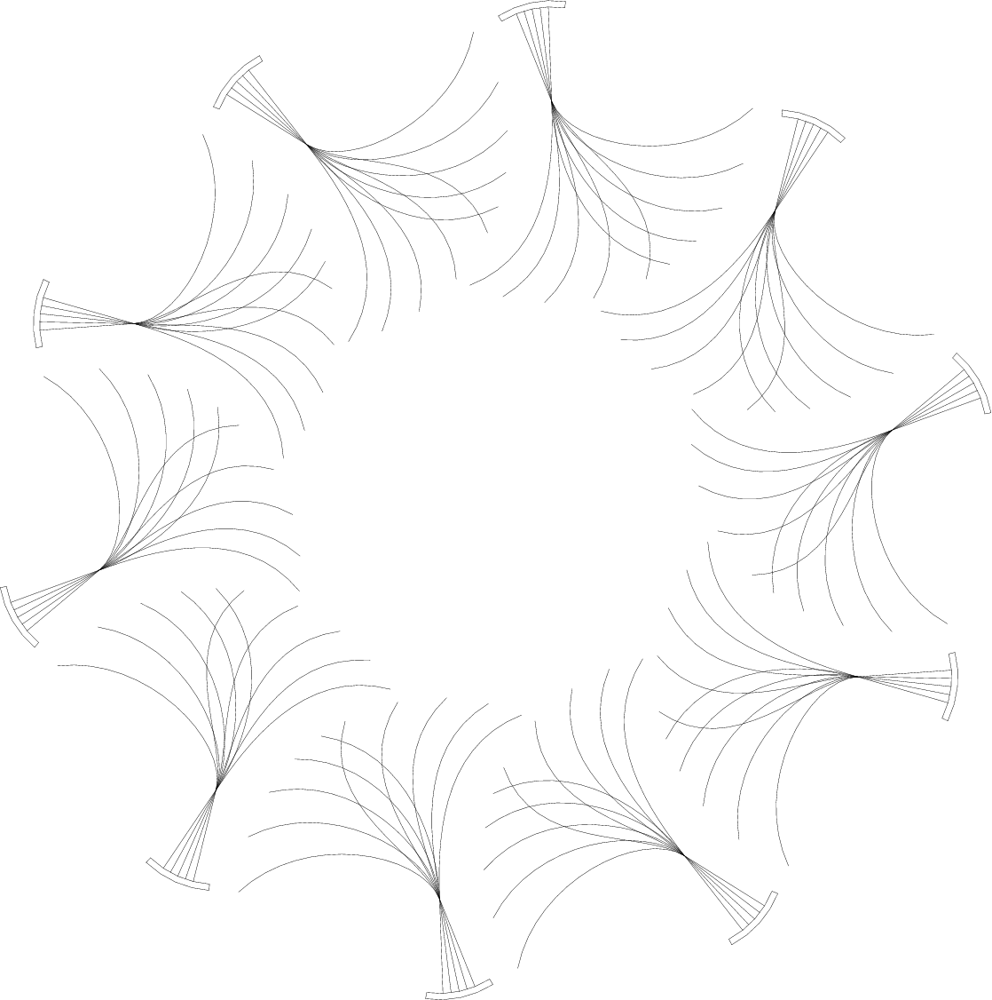

nik
===

A personal C++ library, designed as a partially compatible alternative to the STL library.

# Status

Nowhere near release yet.

# Intentions

The intentions of reinventing such a large time-consuming wheel are manifold:

1. **Design**: As my background is in math, I have preferrence for well polished unifying narratives,
which I do not see in the implementation of the GNU Compiler Collection regarding the STL library.
I aim to provide such storytelling. Not only to make programming easier for myself in the longrun
but for Indigenous youth who take on the task of learning to code with few or no mentors in an
irregular landscape of programming and computing science documentation.
2. **Integrity**: This goes back to my pride and how I was raised as an Inuk---as well as my training
in honors math---but my philosophy is I shouldn't be allowed to use a tool unless I can reinvent it myself.
I shouldn't be allowed to use a theorem unless I can prove it (or know the proof of it) myself. I'm more
than happy to use the tools of others---certainly there's not enough time in ones life or career to actually
reinvent everything---but in theory I should be able to reinvent any tools I use if I had to.  Best way to
learn how to code is to recode the best existing paradigms, methods and structures of a language.
3. **Legacy**: Although I'm using the GNU open source license for my own code, the primary copyright is still
myself, but the secondary copyright is *The Inuit Nation*. As far as I get **here**, the unified stories and
tools I provide are my legacy to future generations of Inuit. It is the *Inuit Way* to leave this world better
off than it was before you as an individual came into it. I aim to see my people prosper.

There are further reasons of course, but this list of three will suffice.

# Design:

The design can be thought of as *intersectional*. Meaning it is a single design at the intersection of several persectives.
This also means access to the representation/explanation of this design comes from a few differing angles.

### Angle: Language

C++ is a mix-bag of many paradigms. As it remains backwards compatible with C it puts emphasis on efficiency by providing
a semiotic space---a refined language/grammar---to discuss models of the *CPU* and of the *RAM* of a computer's hardware.
As amazing job it does in that area, it also tends to go downhill in its ease of use from there on.

### Angle: Hardware

As C++'s claim to fame is Object Oriented Programming, I've always found it odd the choice of api classes it provides
to its coders.  More importantly, I've always found it odd it doesn't run narratives or themes around hardware.

Hardware is modular, and swappable and changes over time, but it doesn't change that quickly, and even for all the changes
there effectively are types of hardware as abstract concepts which persist. Why not represent all these other components
of the computer in addition to the hardware (CPU and RAM) for which it privileges?

The design of the **nik** library revolves around hardware. At the same time, if you take all of this from a broader sociological
lens, hardware is largely the representation of the interactivity of our human senses: 

+ **graphic** - representative hardware: *screens*. Pixels, colors, bezier curves, fonts, etc.
+ **kinesthetic** - representative hardware: *mouse*. Trackpad, clicks, motion analysis and interpretation.
+ **literic** - representative hardware: *keyboard*. Characters, unicode, regular expressions, textual analysis.
+ **numeric** - representative hardware: *processor*. CPU, registers, numbers, math, memory storage, numerical analysis.
+ **phonetic** - representative hardware: *soundcard*. Speakers, headphones, fourier transforms, signal processing.
+ **interic** - representative hardware: network card. MAC protocol, TCP/IP protocols, internet protocols.
+ **generic** - representative hardware: *adaptive*. Templates. Generic patterns found across the previously listed hardware.

Whatever app, for whatever purpose it is designed, it still needs to be implemented with hardware in mind, which is why my library
privileges hardware types.

If you look at it from a sociological lens however, all *apps* are representations of some human social process---existing or new.
The point being, when someone is designing a new app, they are designing for human use, as a tool to supplement their existing
abilities; to aid in a personal or social problem they are otherwise unable to resolve alone; to relieve stress; to augment their
existing options in communicating or expressing themselves. The list goes on.

All the human uses of design have been long studied by *humanists* in their aim to understand the human experience.
The humanist angle provides a nice modular form for code organization and reference.

### Angle: Humanist

Key phrase: **technology space**. This is my own personal design paradigm inspired by literary theory.

Although I do borrow from the humanist perspective, their wisdom still needs to be recontextualized in a computing science
framework---what I have learned from critiquing the human experience follows a forced conversion as a weak mathematical model.

A *technology space* is a weak specification with three parts: a *context space*, a *semiotic space*, and a *media space*.
As a technology space is meant to represent a *digit* human experience,

1. The **context space**: represents the digital context of the digital human social process being described.
2. The **semiotic space**: is made up of the labels and names and general concepts used to interact with the context.
Context is existential, and exists on its own regardless of how we humans describe it. But when we do describe it,
we do it with constructs and signs and signfiers and signfieds that make sense to us, and this is the semiotic space.
3. The **media space**: is the logic system which puts constraints upon the relationships between the context and its semiotic space.

Basically, with the semiotic space, we can combinatorially prescribe any representation or order of representation we want in
regards to the context being described; it is a basic trait of human language design: Natural language is adaptive. Regardless,
this freedom to imbue is still gradual---over any short period of time, things remain fairly stable, otherwise it would
be hard to communicate in a social setting. We'd all be speaking different languages. This system of constraints that
make up the media space is a mediator of meaning: media constructs are semantics.

There's one last important feature of a technology space: It is *recursive*. A technology space is decomposed into its
context, semiotics, and media, but each of these spaces themselves are technology spaces: meaning each can be broken
down into their own respective contexts, semiotics, and medias.

The design of this paradigm is to mitigate the complexity of the digital human experience. In that sense it is similar
to the *real number line* in mathematics. In science and engineering, you end up with a finite approximation of a measurement,
but in theory you can take the precision as far as you need to sufficiently approximate whatever it is you're modelling.
With a technology space, no one expects you to take infinitely many refinements of a given space; take only as many
refinements as you need for your design.

This angle is also embedded in the organization of code of the nik library.

### Angle: Object Disorientation

C++ privileges the Object Oriented Paradigm (OOP). As the grammar is sufficiently (and problematically) expressive,
you can as it turns out avoid the OOP altogether if you'd like. The OOP has its strengths and pitfalls. A quote from
the *Structure and Interpretation of Computer Programs* explains brilliantly in fact:

> The object model approximates the world by dividing it into separate pieces. The functional model does not modularize along
> object boundaries. The object model is useful when the unshared state of the ``objects'' is much larger than the state that
> they share. An example of a place where the object viewpoint fails is quantum mechanics, where thinking of things as individual
> particles leads to paradoxes and confusions. Unifying the object view with the functional view may have little to do with
> programming, but rather with fundamental epistemological issues. (3.5 Streams, footnote 76)

When you're designing a library for processor as well as memory efficiency, you will often have to apply the engineering technique
of multiplexing: Sharing space. The other strength of C++ is template programming: genericicity. As it turns out, the generic
programming paradigm is functional in nature, and as the above quote points out, it and the OOP are not always an easy match.

The Object Disorientation paradigm here considers this and looks to strike a balance between the two to maintain a certain
level of efficiency.

My primary inspiration to explain what I mean is actually the *greatest common divisor* algorithm as described in the below
pseudocode (for clarity of explanation, it is coded without optimization):

> _gcd(a,b)
> {
> >	if (b == 0) return a;
> >	else return _gcd(b,a%b);
> }

> gcd(a,b)
> {
> >	if (a >= 0 and b >= 0)
> >	{
> > >		if (a >= b) return _gcd(a,b);
> > >		else return _gcd(b,a);
> >	}
> }

The focus of this style of code is to modularize the efficient and reusable but otherwise unsafe algorithm from the safe but
contextually efficient and otherwise less portable code. The *_gcd* is fast as it does not need to check each time whether or
not *a >= b*, it simply assumes it is. The *gcd* checks types and conditions and branches its logic which as an effect is
expensive and restrictive on its potential use, but it's the gatekeeper and provides a safe environment for the efficient
version to run properly. It only needs to be run once, and then the recursive and efficient application can be called to run
its cycles.

In my head, it intuitively looks and feels like this:

From the outside looking in, you have a clean *handle*, an interface to work with safely, but the innards are messy wires,
which you are free to work with directly if you know what you're doing. If you don't know what you're doing, don't mess with
the low level designs, but you should still be given a choice. This is my biggest pet peeve with the GNU STL, yeah it works,
but it holds your hand whenever you want to do something else. As it's open source, yeah you're free to change it, but it's
not designed with reusability in mind. Every time you want something new, you have to make it new from scratch, even if it's
otherwise quite similar (but not similar enough) to some existing class. That place where sharing and non-sharing meet is
where OOP shows its weakness.

The Object Disorientation paradigm seperates efficient classes from safe classes, aiming for the best of both worlds when it
comes to reusability of code as well as efficiency, safety and optimization.

### Angle: Prototyping

C++ is known to be slower in production. It takes longer to code. With a strongly typed compiled language like this, it's
more difficult to prototype applications on the fly. The design of the nik library aims to address this---within reason.
The design privileges unified literary narrative/theme designs as well as unified implementation designs. As such the
code is intended to be modular and extensible with as much reusable code as possible. To further this aim the documentation
is intended to be thorough with a user-friendly interface: Along with the narratives and themes described here to orient
ones reading, the documentation style will be similar to that of the Qt C++ library. I gotta say, I'm a fan of their
quality documentation.

## Intersectionality - Bringing the angles together.

This is the overall design. The code organization is broken down into folders:

+ context
+ semiotic
+ media
+ meta

As for object disorientation: efficient vs safe classes, the efficient reusable but unsafe classes are organized into
the *context* and *semiotic* folders. The safe general user-friendly classes are in the *media* folder. As the
"reusability" is largely implemented with template meta-programming, there is a special folder *meta* which holds
specifically template metacode.

From the interpretation of a technology space, we narrow our scope to a *computability space*, which means we interpret
general contexts as memory or data. As C++ privilegs classes, you might be tempted to think abstract classes would fill
the context folder, but it's actually the opposite: classes are representations, constructs of our memory, and so from
this point of view it makes sense for such generic classes to compose the *semiotic* folder. Even within a computability
space, memory as context is infinite in interpreting its possible structure, and so it is in fact the generic typefree
template procedures which form the bulk of the *context* folder.

As said above, the *media* folder holds polished safe classes. It is the interface for the general user, the one who
wants to prototype without worry of safeties. At this level of complexity and optimization; at this order of magnitude,
we hold our interactive hardware classes categorized themselves into the following folders:

+ *graphic*
+ *kinesthetic*
+ *literic*
+ *numeric*
+ *phonetic*
+ *interic*
+ *generic*

Again, generic is for safe classes which aren't limited to hardware; this is to say: generic data structures like lists and vectors.

